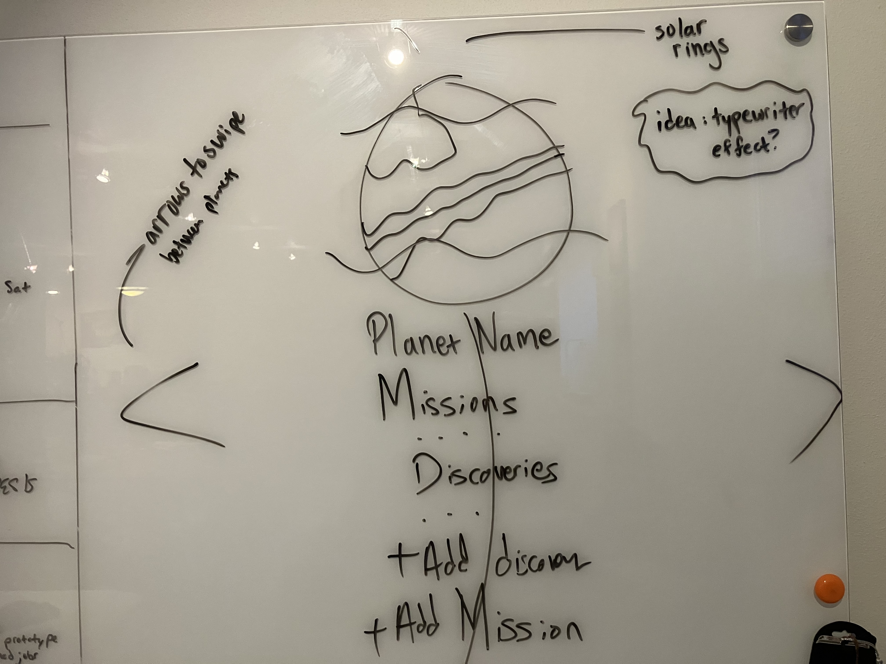
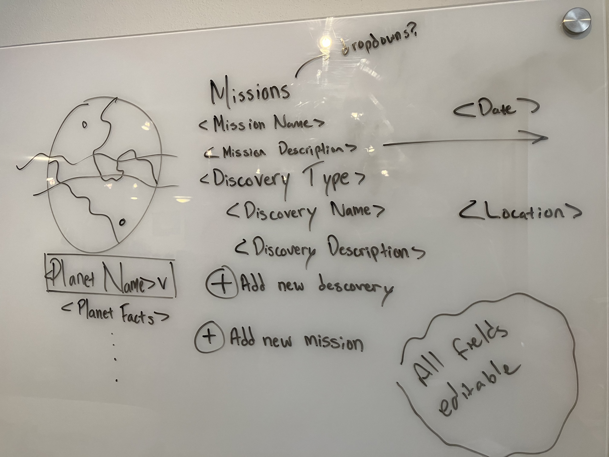

## 11/8/2024
- I spent some time familiarizing myself with the existing codebase (particularly, the DTOs, database setup, and schema) and the requirements of the project.
- I integrated the .NET application with a starter .NET + Angular template to get the project up and running in Visual Studio.
- In the evening, I spent a lot of time trying to figure out why the Angular proxy wasn't connecting to the .NET API. (It was instead trying to go through port 4200.)
  The first issue was that the Angular proxy was not set up correctly. I fixed it by adding a `proxy.conf.json` file and updating the `start` script in `package.json` to use the proxy configuration.
- But there was another issue I didn't understand until later: the .NET API was not available when the Angular application first tried to access it.
  The error was "[webpack-dev-server] [HPM] Error occurred while proxying request localhost:4200/api/planet/dropdown to https://localhost:7221/ [ECONNREFUSED] (https://nodejs.org/api/errors.html#errors_common_system_errors)"
- I tried a variety of fixes online to try to address it, but I later realized that there was no error if I waited a few seconds and then refreshed the page. The
  ECONNREFUSED message should have been a clue.
- Update 11/9: Wow, the getting started guide for the Angular CLI does mention this issue... (https://learn.microsoft.com/en-us/visualstudio/javascript/tutorial-asp-net-core-with-angular?view=vs-2022#troubleshooting) I should have read that more carefully.
  - It also mentions: "Also, verify that the backend is configured to start before the front end", and I did this as part of my previous troubleshooting.
- I also started brainstorming the visuals of the application.

## 11/9/2024
- To resolve the initial proxy failure, I have decided to create an Angular service that will consolidate API calls and handle errors and retries.
- - Explain why this isn't ideal but is a "good enough" solution for now.
- Considered creating a constants file to store API endpoints, and though this would provide central definitions and type safety, I deleted it because it added unnecessary complexity and made the services more verbose.
- Idea: every mission and discovery needs to be able to be added and deleted. Instead of a submission form, it might be nice to just type in a field to save it.

## 11/10/2024
- Added the ability to retrieve a Planet from the database and display it (roughly) in the Angular app.
- Modules -> Standalone. Angular updates.
- Allow getting missions by planet ID? Key column
- Should consider when to return the invalid result

## 11/11/2024
- Finished getters. Still need to work out some validation logic - should it happen both on the client and on the server?

## 11/12/2024
- Implemented PUT, POST, and DELETE for missions and discoveries.
- Used (blur) and (change) hooks with Angular to automatically update the server side on changes. This will be 1) familiar to users of modern apps like Notion / Docs, and 2) faster to implement than separate viewers and editors.

## 11/13/2024
- Fixed validation.
- Added CSS and images from Kenney.nl.

## What I would do if I continued this project
- Add unit testing. Add documentation to the code.
- Combine discovery and mission forms? Make a generic version that can bind to a data model? Many similarities.
- Consider consolidating validation to the server only instead of duplicating validation logic?
- Create reusable validator functions on the server/API (example: lots of copied/pasted character length)
- Is it possible to https://learn.microsoft.com/en-us/aspnet/mvc/overview/older-versions-1/models-data/validation-with-the-data-annotation-validators-cs
- Use paginated responses for large amounts of data
- Validaiton logic is duplicated between updates and creation requests